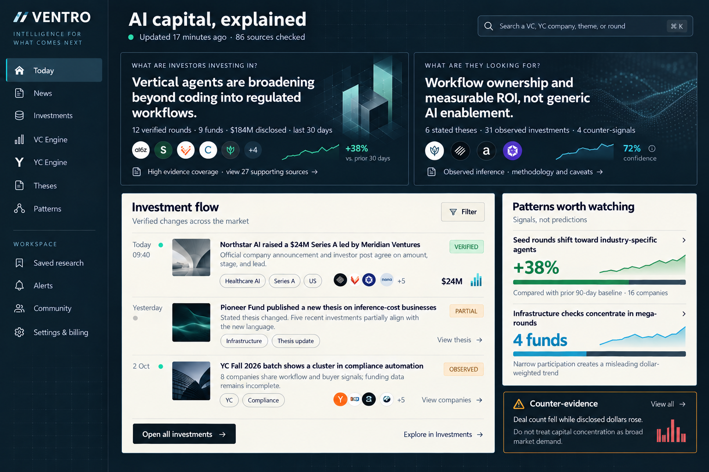

# Design: Ventro Evidence-First AI Investment Intelligence System

Generated by `/office-hours` on 2026-10-05  
Branch: `main`  
Repo: `solostackweb/ventro`  
Status: APPROVED  
Mode: Startup

## Problem Statement

Aspiring student founders currently assemble a view of the AI market by moving between news sites, LinkedIn, X, YC pages, VC websites, databases, newsletters, and spreadsheets. The information is fragmented, inconsistently sourced, quickly stale, and rarely connected into an explanation of capital movement.

Ventro must answer two questions with inspectable evidence:

1. What are investors investing in now?
2. What are investors looking for from the market?

News, VC, YC, investments, stated theses, observed theses, and patterns are all first-class engines. Ideation and validation are downstream uses of this intelligence. Ventro does not promise a guaranteed fundable idea or predict a fund's next investment.

## Demand Evidence

- The founder has discussed the problem with more than 50 students in their class who aspire to become founders.
- Those students report that their market knowledge is scattered across multiple sources and are waiting for the VC and YC intelligence engines to work.
- The strongest stated job is understanding the AI investment market in one place, then using that evidence to discover or assess startup opportunities.
- Demand is promising but pre-launch. No unguided usage, retention, or willingness-to-pay evidence exists yet.

## Status Quo

Students manually combine broad news, company announcements, investor content, YC information, funding databases, social media, and personal notes. This produces three recurring failures:

- They see events but not the relationship between events, investors, theses, and market patterns.
- They confuse large disclosed rounds with broad early-stage opportunity.
- They cannot distinguish an investor's stated position from an inference based on observed investments.

## Target User and Product Wedge

The first user is an aspiring student founder researching the AI market. The launch wedge is not a narrow idea generator. It is a trustworthy intelligence workspace in which each engine contributes to the same two answers.

The first exceptional loop is:

1. See a current investment or thesis change.
2. Inspect the original evidence and verification status.
3. understand the affected company, investors, YC context, and related events.
4. See patterns with baselines, sample sizes, counter-evidence, and coverage limits.
5. Save a research thesis or idea hypothesis and receive changes over time.

## Current Repository Assessment

Preliminary score: **5.5/10**. The repository is a broad, functioning product scaffold with meaningful domain coverage, but its intelligence layer is not yet trustworthy enough to support the product promise.

What already exists:

- Next.js 16 and React 19 application with 27 pages and 35 API routes.
- Supabase/Postgres schema, 10 migrations, authentication, onboarding, profiles, follows, saved items, alerts, community, admin, and billing surfaces.
- News, company, investor, YC, investment, pattern, settings, and admin interfaces.
- R2 integration, source connector registry, ingestion scripts, story clustering, funding extraction, pattern detection, and thesis extraction.
- Nineteen Jest test files; TypeScript currently passes.
- Phase-zero source rights, evaluation, journey, and seed documentation.

Material gaps:

- `thesis-extractor.ts` identifies stated theses through keyword sentence selection and computes observed theses from tag frequency. It does not yet perform attributable claim extraction, semantic comparison, change detection, or thesis reasoning.
- `pattern-detector.ts` uses fixed-count heuristics. One concentration detector explicitly sets its historical baseline to zero. Confidence is largely derived from sample size instead of evidence quality, source independence, or statistical stability.
- The schema contains domain-rich tables but no single claim-and-evidence spine that can trace a published answer back through extraction and model runs to archived source bytes.
- Pipeline scheduling exists, but there is no durable job state machine with leases, replay boundaries, dead-letter handling, per-stage idempotency keys, or cost accounting.
- The dashboard and engine pages largely render separate database areas. They do not yet compose the two top-level answers.
- Several client pages own repeated loading, filtering, entitlement, and error-state logic.
- Access control is unsafe for production: the trial is coupled to checkout, entitlement fields are not sufficiently protected from user-profile updates, and incomplete payment routes must be disabled until the final commercial-activation phase.
- Main-dashboard pagination is implemented.
- Typecheck, lint, tests, and production build currently pass. Access-control and trial regression coverage remains incomplete.

## Constraints

- Keep Next.js for the product and API surface.
- Keep Supabase/Postgres as the canonical structured datastore.
- Keep Cloudflare R2 as the permitted raw/source archive.
- Keep GitHub Actions for scheduled orchestration initially.
- Support OpenAI and open-source models behind provider-neutral contracts.
- Tavily and Firecrawl remain gap-fill tools, not the default source of truth.
- Preserve source rights, attribution, retention, and commercial-use metadata.
- Never publish an inferred thesis as an investor's stated position.
- Never represent undisclosed investment amounts as zero.
- Public claims must retain evidence and correction history.
- Increase eligible student access from 10 to **20 days**, no card required, without resetting or silently extending previously consumed trials.

## Premises

1. VC, YC, news, investments, theses, and patterns remain first-class product engines.
2. The homepage synthesizes those engines into the two core answers without hiding access to each engine.
3. Ventro publishes evidence-backed intelligence and opportunity hypotheses, not guaranteed fundable ideas.
4. The durable advantage is a time-versioned evidence graph, not a prompt or a larger scraped dataset.
5. Fifty interested students provide pilot access, not proof of retention or payment.
6. Confidence must combine source quality, source independence, extraction certainty, entity-resolution certainty, sample size, recency, and counter-evidence.

## Market Perspective

Private-market incumbents combine automated collection with continuous human verification. Ventro cannot match their breadth early, so it should win on transparent AI-market interpretation, accessible pricing, and a source-to-conclusion trail.

AI capital is highly concentrated in mega-rounds. Dollar-weighted charts therefore need deal-count views, stage segmentation, concentration warnings, and disclosed-only labels. A rise in disclosed dollars is not automatically a rise in founder-accessible opportunity.

## Approaches Considered

### Approach A: Evidence-First Modular Monolith — Selected

Keep the current deployment shape while creating a shared intelligence spine. Discovery, fetching, extraction, resolution, verification, publication, thesis, pattern, and answer generation remain modules with explicit contracts inside one system. This covers the full product without premature distributed infrastructure.

### Approach B: Incrementally Harden Each Existing Engine — Rejected

Improve news, investments, profiles, theses, and patterns separately. This ships visible changes faster but preserves contract drift and duplicated provenance logic between engines.

### Approach C: Event-Driven Intelligence Platform — Deferred

Split stages into independently queued services and workers. This is the likely scale-out path after sustained ingestion volume proves the need, but it is too operationally expensive before product-market fit.

## Recommended Architecture

```text
Official feeds / APIs / permitted pages / gap-fill search
                         |
                         v
                 Source connector registry
                         |
                         v
        Fetch runs -> R2 source archive -> normalized documents
                         |                       |
                         |                       v
                         |              document versions/chunks
                         |                       |
                         +-----------------------+
                                                 v
                                      extraction/model runs
                                                 |
                                                 v
                                      candidate claims + spans
                                                 |
                          +----------------------+--------------------+
                          v                      v                    v
                    entity resolution     funding events      thesis statements
                          |                      |                    |
                          +----------------------+--------------------+
                                                 v
                                      verification/publication
                                                 |
                          +----------------------+--------------------+
                          v                      v                    v
                    VC / YC views         pattern engine       answer engine
                          |                      |                    |
                          +----------------------+--------------------+
                                                 v
                                    Next.js APIs and user workspace
```

### Canonical Intelligence Spine

Add or normalize these concepts:

- `source_connectors`: rights, cadence, trust tier, ownership, rate limits, and health.
- `fetch_runs`: one attempt with status, latency, checksum, archive key, retry state, and cost.
- `source_documents` and `document_versions`: canonical URLs, content hashes, publication time, fetched time, and supersession.
- `model_runs`: provider, model, prompt/schema version, tokens, latency, cost, and outcome.
- `claims`: subject, predicate, object/value, effective date, claim type, extraction confidence, and publication status.
- `claim_evidence`: exact source version and evidence span supporting or contradicting a claim.
- `entity_aliases` and `resolution_decisions`: repeatable identity matching with manual overrides.
- `funding_rounds` and `round_participants`: one round, many participants, explicit roles, conflicts, and evidence.
- `thesis_statements`: stated/inferred type, validity period, evidence, methodology, sample, and caveats.
- `pattern_runs` and `pattern_observations`: reproducible inputs, baseline, segment, measure, confidence, counterexamples, and review decision.
- `answer_snapshots`: time-bound answers to the two product questions, composed from published claims and patterns.
- `pipeline_runs` and `stage_attempts`: end-to-end scheduling, idempotency, replay, dead-letter status, and stage metrics.

### Engine Contracts

**News engine**

- Cluster source documents into stories without destroying source identity.
- Store image provenance, summary provenance, ingestion history, corrections, and per-claim support.
- Display publisher, original link, event time, last checked time, verification state, and source timeline.

**VC engine**

- Track firms, fund vehicles, partners only when relevant and lawfully sourced, investments, thesis changes, source coverage, and activity history.
- Seed the initial 100 tracked firms with official URLs, aliases, geographies, stages, check-size disclosures, source connectors, and audit state.

**YC engine**

- Treat YC as a company/batch membership dimension, not as an investor equivalent.
- Use licensed or manually curated sources until automated directory access is explicitly allowed.
- Maintain membership evidence, batch history, company changes, funding, and related patterns.

**Investment engine**

- Separate funding rounds from investor participation.
- Preserve disclosed currencies and conversions with rates and dates.
- Model conflicts, unknown roles, undisclosed amounts, and correction history explicitly.

**Thesis engine**

- Stated thesis: extract attributable propositions from official sources with exact evidence spans.
- Observed thesis: compute time-windowed behavior from verified investments and label it as inference.
- Compare stated versus observed behavior without claiming contradiction when coverage is incomplete.
- Version results so users can see how a fund's thesis changes over time.

**Pattern engine**

- Run deterministic measures before narrative generation.
- Require a baseline, segment definition, minimum evidence threshold, independence checks, counterexamples, sensitivity analysis, and coverage notes.
- Keep candidate, reviewed, published, corrected, retired, and rejected states.

**Answer engine**

- Produce the two headline answers for selected time, geography, stage, and domain.
- Link every sentence to claims, events, or patterns.
- Surface uncertainty and counter-evidence beside the conclusion.
- Cache time-bound snapshots and recompute only from newly published evidence.

## AI Model Strategy

- Use deterministic parsing and rules for URLs, hashes, dates, currencies, known identifiers, joins, thresholds, and publication gates.
- Use small models for classification and structured extraction after cheap rules.
- Use stronger models only for ambiguous entity resolution, thesis interpretation, pattern narration, and answer synthesis.
- Require strict schemas with reject/retry paths; a failed call cannot become an empty verified result.
- Maintain labelled evaluation sets for funding extraction, entity resolution, thesis attribution, summary faithfulness, pattern validity, and answer citation completeness.
- Run provider comparisons against the same evaluation set before changing a production model.

## Product and Visual Direction

The approved hierarchy leads with the two answers and then exposes investment flow, patterns, evidence, and counter-evidence. Each engine remains directly accessible in navigation.

Approved visual direction:



Design principles:

- Premium editorial-financial intelligence, not generic admin SaaS.
- Dark ink/navy frame with warm ivory research surfaces.
- Restrained cyan, green, amber, and red reserved for data meaning.
- Strong typography and information density with calm spacing.
- Few container cards; use composition, dividers, and type hierarchy first.
- Confidence, coverage, sources, and counter-evidence are visible at the scan layer.
- Every page specifies loading, empty, partial, stale, conflict, error, and corrected states.
- Responsive mobile design preserves the two-question hierarchy and collapses engine navigation without hiding evidence.

## Required Account and Commercial Surfaces

- Profile: identity, role, biography, interests, geography, stage, followed entities, and data export/delete controls.
- Preferences: AI domains, geographies, stages, engine weights, alert cadence, digest channels, explanation and reset controls.
- Security: password change/reset, active sessions, sign-out-all, OAuth connections, email verification, and account deletion.
- Payments: deferred until commercial activation. Until then, checkout and provider webhook surfaces are disabled, payment CTAs are unavailable, and no provider credential is required.
- Future billing: current plan, payment state, renewal/cancellation, invoice history, failed-payment recovery, refund/support path, and entitlement audit are implemented only during commercial activation.
- Trial: eligible verified `@mastersunion.org` users receive exactly one **20-day** access period, calculated server-side in UTC. No payment card is required and no automatic charge occurs at expiry.
- Trial activation: independent of checkout and payment providers, authenticated by server identity, atomically issued with an audit event, and inaccessible through direct client profile updates.
- Trial migration: change copy, constants, tests, API behavior, audit events, policies, and documentation together. Active legacy trials end 20 days after their original issue time; expired or previously consumed trials are not revived or reissued.

## Security and Trust Requirements

- Until commercial activation, checkout and payment webhooks fail closed and cannot call a provider or mutate subscription/entitlement state.
- Authenticated users cannot directly update entitlement, trial timestamps, subscription state, or billing-authority fields.
- When payments are implemented later, never grant paid entitlement from client checkout intent. Only verified, idempotent provider events may activate subscription access.
- Keep service-role access server-only and restrict admin routes with explicit authorization.
- Validate every ingestion URL against connector policy and protect fetchers from private-network targets.
- Redact secrets and personal data from logs and model prompts.
- Preserve correction history rather than overwriting disputed facts silently.

## Delivery Plan

### Phase 0: Safety and Contract Freeze

- Protect the user's existing uncommitted ingestion work.
- Write architecture decision records for canonical entities, evidence, rounds, thesis types, and pipeline states.
- Decouple the 20-day verified-student trial from checkout and implement one atomic, server-authoritative activation path.
- Lock down entitlement fields and centralize expiry-aware access checks across protected APIs and server-rendered pages.
- Disable checkout, payment CTAs, provider calls, and webhook mutation until the final commercial-activation phase.
- Repair Jest ESM compatibility and ESLint ignore boundaries.
- Establish database migration and rollback policy.

### Phase 1: Evidence Spine and Pipeline Operations

- Add document/version, claim/evidence, model-run, and pipeline-run structures.
- Backfill current stories, sources, rounds, and thesis records without losing stable URLs.
- Add job leases, idempotency keys, bounded retries, dead-letter state, replay tooling, and per-stage metrics.
- Build source health and ingestion-history admin views.

### Phase 2: News, VC, YC, and Investment Reliability

- Complete source seeds for the first 100 VCs and the approved YC/company scope.
- Upgrade news clustering, image/source provenance, correction handling, and pagination.
- Normalize funding rounds and participation roles.
- Complete VC and YC profile timelines from the evidence spine.

### Phase 3: Thesis and Pattern Intelligence

- Replace keyword thesis extraction with schema-bound, attributable claim extraction.
- Add stated-versus-observed comparisons and thesis version history.
- Replace fixed pattern heuristics with reproducible measures, baselines, segmentation, counterexamples, and review thresholds.
- Run labelled evaluations and publish scorecards before enabling automatic publication.

### Phase 4: Answer Engine and UI System

- Build time/geography/stage/domain answer snapshots for the two core questions.
- Implement the approved visual system and shared data-display primitives.
- Redesign Today, News, Investments, VC, YC, Thesis, Pattern, and profile pages around evidence-first drill-down.
- Add mobile, accessibility, performance, loading, empty, partial, conflict, and failure-state coverage.

### Phase 5: Personalization, Accounts, and Access

- Centralize entitlements and server-side feature policy.
- Implement profile, preferences, password/security, sessions, exports, deletion, and non-payment access status.
- Verify the 20-day student-offer migration and regression suite against production-like legacy data.
- Add personalized rankings with transparent "why this" explanations and reset controls.

### Phase 6: Community and Validation Workflows

- Attach discussion to companies, funds, stories, patterns, and saved research theses.
- Keep community claims separate from the factual corpus unless independently verified.
- Add moderation, reporting, abuse handling, and admin review.
- Add structured idea-validation workspaces only after the intelligence engines meet quality gates.

### Phase 7: Commercial Activation and Payments

- Select the provider and settle pricing, currency, tax, legal, refund, and support policies.
- Implement checkout, verified idempotent webhooks, reconciliation, cancellations, renewals, invoices, failed-payment recovery, and audit history.
- Enable payment CTAs only after sandbox, replay, reordering, invalid-signature, amount/currency, and end-to-end production-readiness tests pass.

## Success Criteria

Data and trust:

- At least 95% of published factual fields link to one or more stored evidence spans.
- Zero stated theses published from non-official sources without explicit labeling.
- Zero paid entitlements granted before verified payment-provider events.
- At least 90% precision on the labelled funding-event test set before automatic publication.
- Every pattern page contains baseline, window, sample, counterexamples, and coverage notes.

Product:

- Ten students complete the core research loop without guidance.
- At least eight can correctly explain why an answer was produced and identify its sources.
- Median time to answer either core question for a selected domain is under five minutes.
- At least five pilot users return in the following week.
- Willingness-to-pay is tested directly; “waiting for launch” is not counted as conversion. Payment conversion is measured only after Phase 7 activation.

Engineering:

- Typecheck, lint, unit, integration, and production build pass in CI.
- Every pipeline stage is idempotent and replayable with a visible failure reason.
- Source freshness, ingestion yield, model cost, and publication rejection rates are measured.
- Core dashboard loads within the agreed performance budget on a typical mobile connection.

## Open Questions

- Which 100 VC firms are the launch set, and what evidence-quality threshold determines inclusion?
- Which YC batches and companies can be tracked automatically under applicable terms?
- What evidence threshold promotes a candidate answer or pattern without manual review?
- Which five AI domains should seed the launch taxonomy?
- Does the 20-day offer remain limited to verified Masters' Union accounts or expand to other students later?
- Which payment provider and legal entity support compliant USD recurring billing?

## Dependencies

- Source-rights review for every enabled connector.
- Supabase migration and backup access.
- R2 bucket and lifecycle configuration.
- Payment-provider production credentials and webhook configuration are deferred dependencies for Phase 7 and do not block Phases 0–6.
- Labelled evaluation corpus and reviewer capacity for thesis/pattern quality gates.

## The Assignment

Run ten unguided sessions with students from the existing 50-person group. Give each participant one task: use the current product or a clickable prototype to determine what investors are funding in one chosen AI domain and what those investors appear to want. Record completion time, sources opened, points of confusion, whether they trust the answer, what they would use next week, and whether they would commit to the $10 plan after a 20-day trial.

## What I Noticed About How You Think

- You repeatedly corrected the framing when it drifted toward an idea generator: “First job is always VC, YC, thesis and pattern data.” That keeps the product anchored in intelligence rather than novelty output.
- You care about hierarchy and visual quality separately. You approved the information structure while asking to reduce blandness, then approved the stronger direction while asking to tone it down. That is useful product taste: structure first, intensity second.
- You are already building, not only describing. The repository spans ingestion, evidence, profiles, investment tracking, billing, and user workflows, even though the foundation still needs consolidation.
